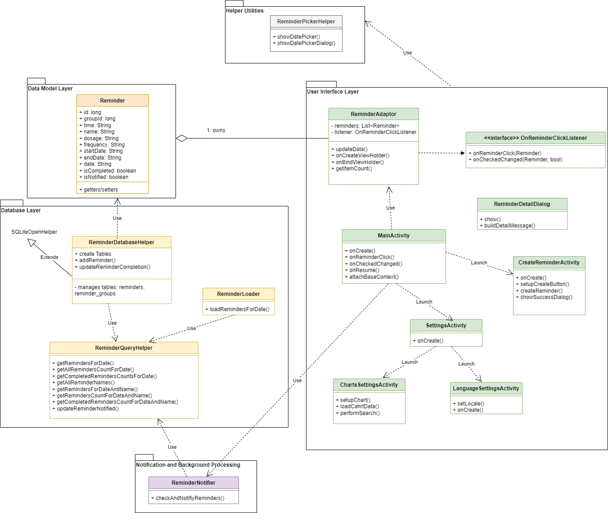

# Medicine Reminder App - Handbook

## Component Overview

1. **Reminder**  
   Represents a medication reminder item, encapsulating all relevant data for a single reminder. Implements Android’s `Parcelable` interface for easy passing between components like Activities or Services. Contains fields such as ID, group ID, time, name, dosage, frequency, start/end dates, display start/end dates, completion status (`isCompleted`), and notification status (`isNotified`). Provides getter and setter methods for every field.

2. **ReminderQueryHelper**  
   A database utility class that simplifies querying reminders stored in an SQLite database for the app. Key responsibilities include:
    - Retrieving reminders filtered by date, name, or other criteria.
    - Counting reminders overall or by completion status with various filters.
    - Fetching unique reminder names.
    - Updating notification status to mark reminders as notified or not.

3. **ReminderDatabaseHelper**  
   A subclass of `SQLiteOpenHelper` that manages the creation, upgrading, insertion, and querying of the local SQLite database for reminders and reminder groups. Key responsibilities include:
    - Setting up two tables: `reminders` (individual entries) and `reminder_groups` (groups of reminders with times stored as JSON arrays).
    - Inserting new reminders and updating corresponding groups while handling repeated reminders based on frequency (DAILY, WEEKLY, etc.).
    - Updating reminders’ completion and notification statuses.
    - Collaborating with `ReminderQueryHelper` to handle query logic while managing database access.

4. **ReminderLoader**  
   Provides utility methods to load reminders for a specific date via `ReminderDatabaseHelper`, returning reminders sorted by time in chronological order.

5. **ReminderAdapter**  
   Connects a list of `Reminder` objects to a `RecyclerView`, efficiently displaying each reminder’s name, time, dosage, and completion status. It handles user interactions via a listener interface that dynamically updates the UI and communicates changes externally. The adapter supports dynamic updates through an `updateData()` method, which replaces the current list and refreshes the display. It also visually indicates a reminder’s completion by toggling the item’s activated state, providing clear feedback to users.

6. **ReminderDetailDialog**  
   A helper class designed to display detailed information about a specific `Reminder` in a dialog box. The details include name, description, dosage, frequency, active date range, and scheduled times, providing users with an informative overview.

7. **DatePickerHelper**  
   Offers utility methods to display a date picker dialog and manage user date selection across various activities. It updates a target `TextView` with the chosen date and optionally refreshes related data, such as reminder lists or chart visualizations. The class provides overloaded `show()` methods tailored for use in `MainActivity`, `CreateReminderActivity`, and `ChartSettingsActivity`, ensuring reminders or chart data are reloaded as needed. Additionally, it includes a simplified method for displaying just the date picker dialog when only UI date display is required.

8. **CreateReminderActivity**  
   Allows users to create new medication reminders through a structured form interface. Key responsibilities include:
    - Initializing UI components including input fields, date pickers, frequency spinner, and multiple time picker rows with add/remove controls.
    - Validating user input and formatting dates for database storage.
    - Inserting one reminder per selected time with a shared group ID into the database.
    - Providing user feedback via dialogs and toasts.

9. **SettingsActivity**  
   Manages the app’s settings screen by initializing the UI and configuring the action bar with a back button and a title. It attaches click listeners to key settings options—such as language settings and chart settings—allowing users to navigate easily to `LanguageSettingsActivity` or `ChartSettingsActivity`. The activity also handles the action bar’s “up” button to support smooth back navigation to the previous screen.

10. **LanguageSettingsActivity**  
    Lets users choose the app’s language through simple UI buttons (like English and Finnish). It updates the app’s locale based on the selected language code, saves this preference using `SharedPreferences`, and then restarts `MainActivity` to immediately apply the language change across the app. The activity also sets up the action bar with a back button and a title and handles the navigation when the user presses the “up” button to return to the previous screen.

11. **ChartsSettingsActivity**  
    This activity displays medication reminder statistics using a bar chart, letting users explore their data easily by selecting custom date ranges and filtering by reminder names. By default, it shows data for all reminders from the past seven days ending today, including both overall counts and completed counts. Users can also specify a date range and reminder name to focus on specific data that matters most to them.

12. **ReminderNotifier**  
    Responsible for checking today’s medication reminders and showing timely notification dialogs for those not yet completed or notified, matching the current time. It uses the app context and database helper to query reminders and update their notification status. The main function, `checkAndNotifyReminders()`, fetches today’s reminders, filters out completed ones, and displays alerts on the main thread when it’s time to take pills. It also marks reminders as notified to avoid repeated alerts. The private helper method `isTimeToNotify()` compares the current time (in Helsinki timezone) with each reminder’s scheduled time to decide when to notify.

13. **MainActivity**  
    The central activity that displays the user’s medication reminders for a selected date in a `RecyclerView`. Key responsibilities include:
    - Initializing the UI components, database helper, and adapter to display reminders.
    - Allowing date selection via a date picker and updating the displayed reminder list accordingly.
    - Handling user interactions such as creating new reminders, opening settings, and clicking on reminder items to show detailed dialogs.
    - Managing reminder completion status changes and updating the database.
    - Periodically checking for due reminders and showing notification dialogs using `ReminderNotifier` on the main thread every minute.
    - Applying the user’s language preference by overriding `attachBaseContext` to update the app locale dynamically.
    - Refreshing the reminder list when the activity resumes to keep data up to date.

## Overview of the Program Structure and Relations Between Components

1. **Data Model Layer**

    At the foundation lies the `Reminder` class, which encapsulates all relevant data for a medication reminder. It acts as the main data carrier between different components. All other classes depend on this model to represent reminders consistently.

2. **Database Layer**

    The app’s persistence is handled primarily by `ReminderDatabaseHelper`, a subclass of `SQLiteOpenHelper`, which manages local SQLite database creation, updates, and data manipulation. It works closely with `ReminderQueryHelper`, a utility class abstracting complex query operations such as filtering reminders by date or completion status. This layered database approach isolates raw database interactions from other parts of the app, improving maintainability.

    The `ReminderLoader` serves as an intermediary utility that fetches reminders from the database and returns them sorted by time, simplifying the retrieval process for the UI layer.

3. **User Interface Layer**
    
    The UI is composed of several activities and adapters:
   - **`MainActivity`** acts as the central screen where users view reminders for a selected date. It initializes UI components, manages interactions, and delegates data loading to `ReminderLoader`.
   - The **`ReminderAdapter`** bridges the `Reminder` data model to the `RecyclerView` UI component, efficiently rendering reminder items and handling user interactions such as marking reminders as completed.
   - **`ReminderDetailDialog`** complements this by providing a detailed popup view of reminder specifics when requested by the user.
   - Activities like **`CreateReminderActivity`**, **`SettingsActivity`**, **`LanguageSettingsActivity`**, and **`ChartSettingsActivity`** provide additional UI functionalities including creating new reminders, app settings management, language selection, and visualization of reminder statistics.

4. **Helper Utilities**

    Supporting the UI and background processes are helper classes like **`DatePickerHelper`**, which standardizes date selection dialogs across multiple activities, ensuring consistent date input handling.

5. **Notification and Background Processing**

    **`ReminderNotifier`** is responsible for periodically checking if there are reminders due at the current time and displaying notification dialogs to alert users. It interacts with the database to query today’s reminders and updates their notification status to prevent repeated alerts. This class runs on the main thread but is invoked regularly via a handler in `MainActivity`, ensuring timely and responsive notifications.

## Known Issues, Challenges, and Ideas for the Future

#### Known Issues:

- The division of responsibilities between `ReminderDatabaseHelper` and its auxiliary class `ReminderQueryHelper` is not yet fully clear-cut. Since the refactoring to extract query-related methods into `ReminderQueryHelper` was done mid-development, `ReminderDatabaseHelper` still retains some query method calls to maintain compatibility with other parts of the code that depend on it. This overlapping responsibility may lead to confusion and maintenance difficulties.
- The database schema design has undergone several revisions (three major changes so far) and might not yet be optimal or fully normalized. There is room for improvement in structuring tables and relationships to better support future features.
- Currently, when creating reminders, there are insufficient constraints — for example, the app does not enforce that the end date should not be earlier than the start date. This can lead to invalid reminder data. It is still undecided whether reminder names should allow duplicates. This question requires more consideration based on the app’s real-world use cases and user expectations.
- The notification system relies on a main-thread polling mechanism to check reminders at regular intervals, which may impact app performance as reminders grow.
  Additionally, reminder dialogs currently only show reliably when the app is in the foreground. If the user leaves the main screen, dialogs may fail to appear and cause crashes due to Android restrictions.

#### Challenges:

- Clarifying and refactoring the database helper classes to achieve clear separation of concerns without breaking existing dependencies.
- Designing a more flexible and robust database schema that can efficiently handle complex reminder recurrence patterns and future extensions.
- Improving input validation and business logic to prevent inconsistent or invalid reminder data entry.
- Defining rules for reminder name uniqueness that balance user flexibility and data integrity.
- Enhancing the notification mechanism to reduce main-thread load and improve energy efficiency on devices.

#### Ideas for the Future:

- Transitioning from local SQLite storage to a backend server-based database to handle larger data volumes, provide better data integrity, and support multi-user scenarios.
- Implementing improved reminder management features, such as automatically hiding reminders marked as completed from the main UI, while providing user controls to toggle the visibility of hidden reminders.
- Expanding reminder content to support rich media, including images, clickable links (e.g., to FDA resources or medication info), and other multimedia elements.
- Refining the UI to be more intuitive and user-friendly, with better accessibility and design polish.
- Adding enhanced analytics and statistics, including weekly or monthly summaries, and enabling users to export or download their medication data.
- Introducing background services and more efficient scheduled tasks (e.g., using WorkManager or AlarmManager) to replace main-thread polling for notifications, thus improving app performance and battery consumption.
- Supporting cloud synchronization to enable users to share and sync their reminders across multiple devices seamlessly.